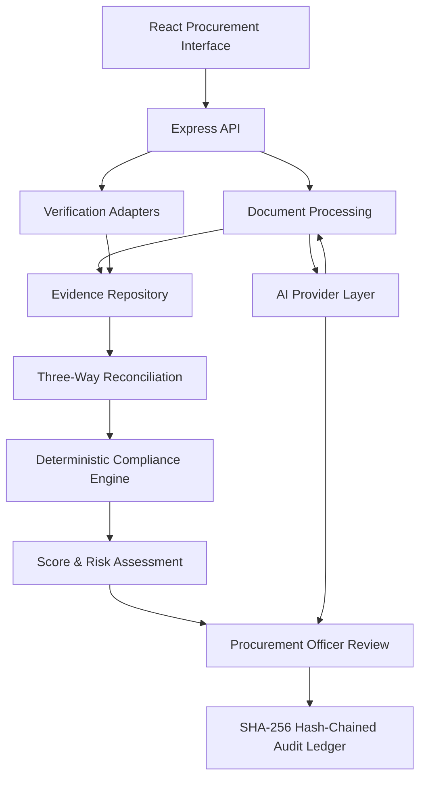
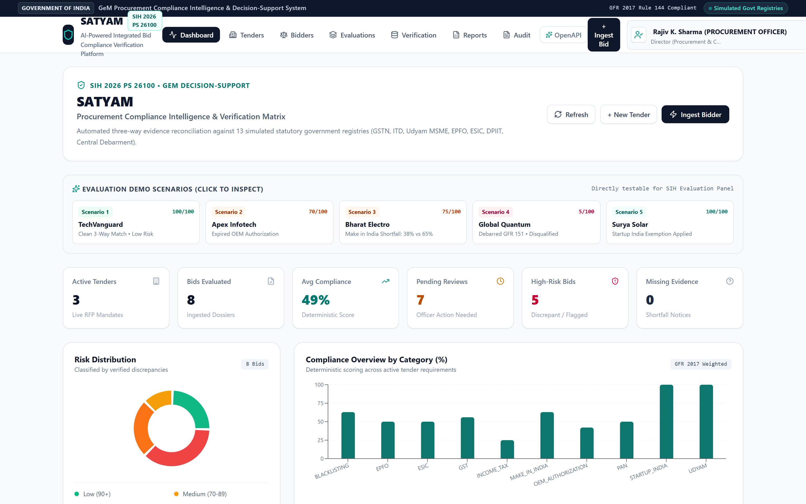
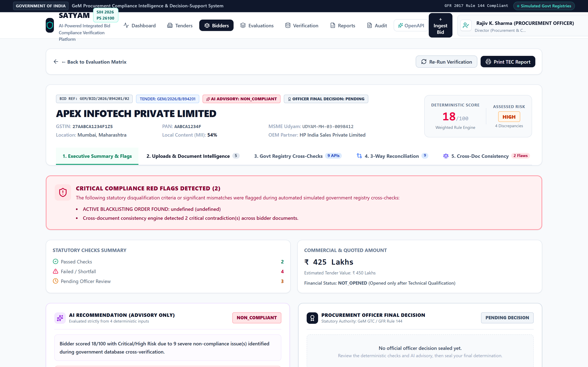
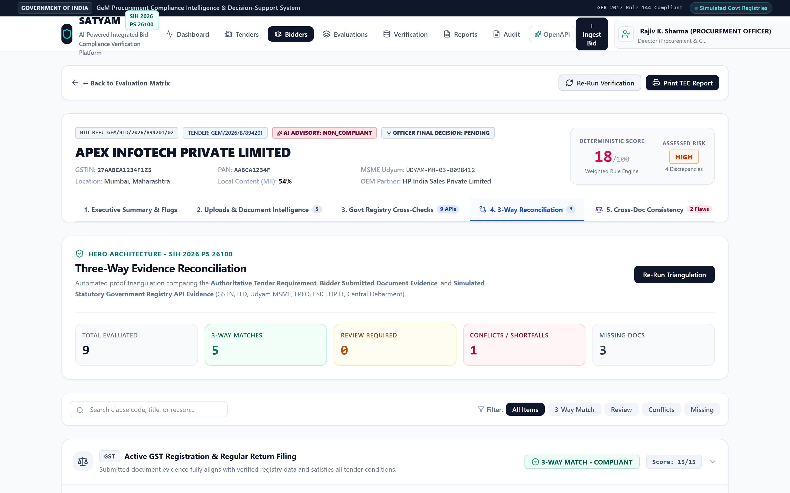
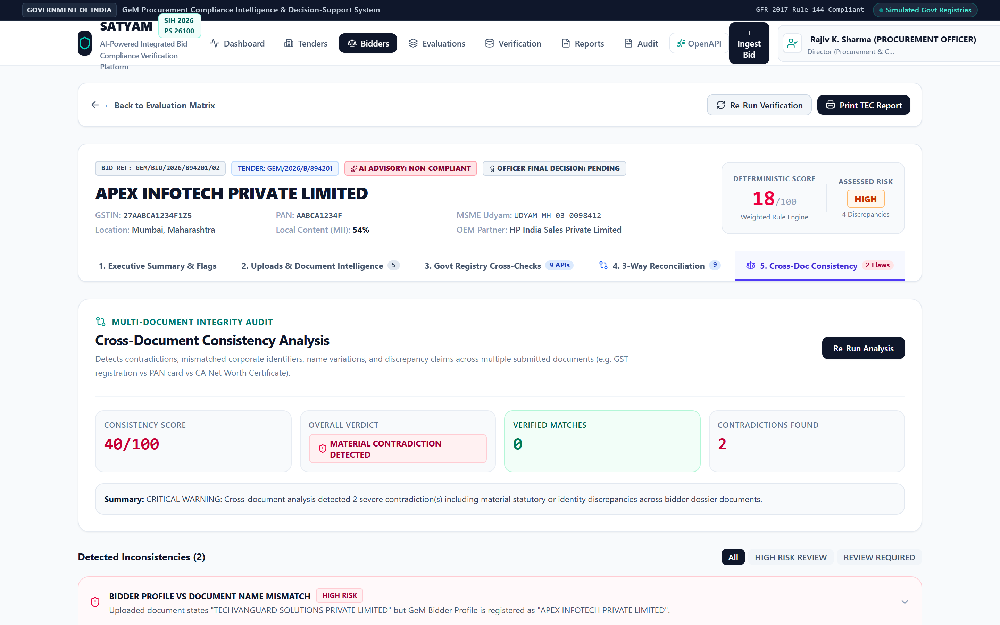
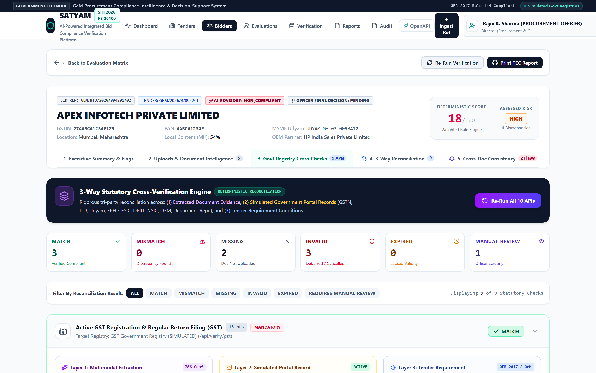
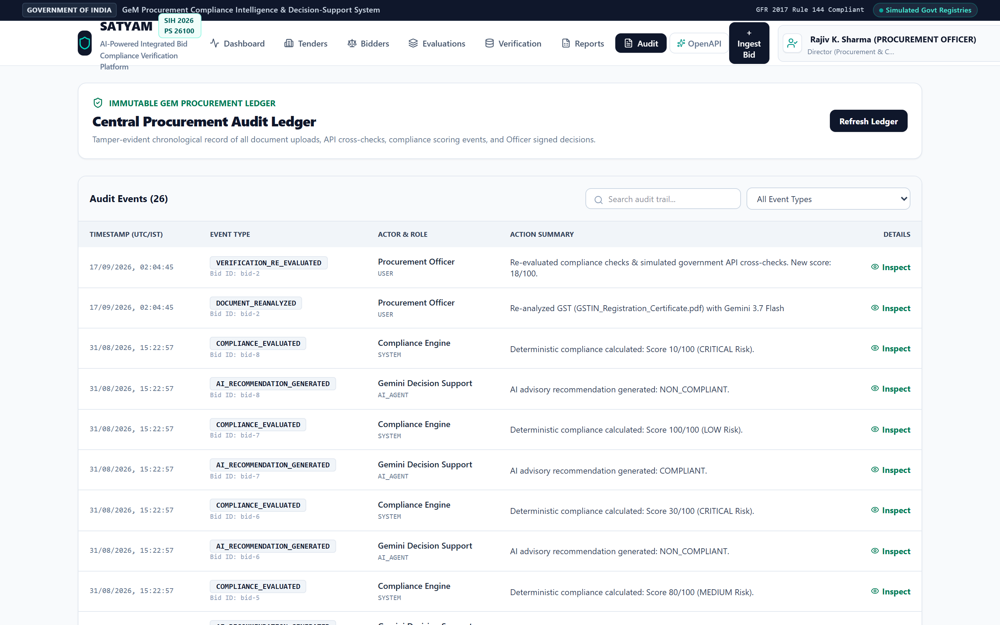

# SATYAM

Government Procurement Bid Compliance Verification Platform

SATYAM is a specialized bid compliance verification and decision-support platform engineered for the Government e-Marketplace (GeM) ecosystem. It automates multi-document evidence extraction, statutory registry cross-verification, three-way reconciliation, and deterministic compliance evaluation under General Financial Rules (GFR 2017) while keeping final decision authority with the authorized Procurement Officer.

[](https://www.sih.gov.in/)
[](https://www.typescriptlang.org/)
[](https://react.dev/)
[](https://nodejs.org/)
[](https://expressjs.com/)
[](https://sqlite.org/)
[](./tests)

---

## Overview

Government procurement requires comprehensive verification of bidder eligibility, statutory registrations, tender-specific requirements, supporting documents, and external evidence. Under the **General Financial Rules (GFR 2017)** and **GeM General Terms & Conditions (GTC)**, evaluation committees must inspect high volumes of technical and commercial documents across hundreds of competing bids within statutory deadlines.

SATYAM consolidates document processing, verification adapters, evidence reconciliation, deterministic compliance evaluation, and officer decision recording into a single workflow. The platform addresses scrutiny backlogs, detects fraudulent or contradictory documentation across submission packages, and provides an auditable, evidence-backed foundation for evaluation committees.

> **Operational Principle**:  
> SATYAM is a decision-support and verification system. The platform generates structured findings, evidence trails, and advisory assessments; final statutory qualification or disqualification remains the exclusive responsibility of the authorized Procurement Officer.

---

## Core Workflow

```
Tender Requirements
        ↓
Bidder Submission
        ↓
Document Processing
        ↓
Registry Verification
        ↓
Three-Way Reconciliation
        ↓
Compliance Engine
        ↓
Score + Risk + Evidence
        ↓
Officer Review
        ↓
Decision Record
        ↓
Audit Ledger
```

---

## Key Capabilities

- **Tender Requirement Management**: Structure tender criteria, eligibility thresholds, and statutory clauses with configurable scoring weights.
- **Bidder Dossier Management**: Centralize multi-document bidder packages including tax registrations, financial statements, and OEM certificates.
- **Document Extraction**: Automated field and entity extraction from structured and semi-structured bid documents.
- **Government Registry Verification Adapters**: Standardized interfaces for cross-referencing claims against statutory registries.
- **Three-Way Reconciliation**: Automated triangulation across tender mandates, bidder claims, and external verification records.
- **Cross-Document Consistency Checks**: Systematic detection of identifier contradictions across annexures (such as PAN mismatch across GSTIN and PAN card).
- **Deterministic Compliance Scoring**: Pure Policy-as-Code scoring normalized to a 0–100 scale with reproducible results.
- **Risk Classification**: Automated categorization into `LOW`, `MEDIUM`, `HIGH`, or `CRITICAL` risk tiers based on statutory rules.
- **Evidence & Provenance Tracking**: Verifiable linkage from compliance findings back to source document hash, page, and excerpt.
- **Officer Decision Workflow**: Human-in-the-loop determination interface capturing official designation, conditions, and mandatory justification.
- **Tamper-Evident Audit Ledger**: SHA-256 backward hash-chained transaction log for forensic traceability.
- **Role-Based Access Control**: Server-side permission boundaries for bidders, procurement officers, auditors, and administrators.
- **Offline Deterministic Fallback**: Built-in fallback provider ensuring complete functionality without external network dependencies.
- **REST API**: Clean OpenAPI-aligned endpoints for integration into wider public procurement architectures.

---

## Architecture



The application is structured into decoupled functional layers. The React frontend interacts with the Express API to ingest bid files, trigger evaluations, and submit officer determinations. Document processing and verification adapters populate a normalized evidence repository, which feeds into the three-way reconciliation engine. 

The AI provider layer assists with unstructured text extraction, clause alignment, and plain-language advisory summaries. Crucially, the **deterministic compliance engine operates independently of AI model output**: compliance rules, mathematical score calculations, and debarment penalties execute via deterministic code to guarantee legal defensibility and prevent non-deterministic hallucinations.

---

## Verification Model

SATYAM evaluates bidder submissions through a systematic six-stage verification model:

1. **Tender Requirement**: The baseline statutory or technical clause defined by the Tender Inviting Authority (e.g., minimum turnover, Class-I local content, active GST registration).
2. **Bidder-Submitted Evidence**: Data extracted directly from the bidder's uploaded documents (invoices, CA certificates, affidavits).
3. **Registry / Verification Evidence**: Independent verification data retrieved through statutory adapters.
4. **Reconciliation**: Triangulation of Tender criteria vs. Bidder claims vs. Registry records to establish data alignment.
5. **Compliance Rule Evaluation**: Deterministic policy rules evaluate whether statutory conditions are met, exempted, or violated.
6. **Officer Review**: Presentation of structured evidence to the Procurement Officer for final decision recording.

### Three-Way Reconciliation
Traditional procurement tools perform simple two-way matching between tender clauses and bidder claims. However, fabricated certificates can appear compliant on paper. SATYAM's Three-Way Reconciliation introduces external registry verification as an independent third vector.

For every evaluated clause, the reconciliation engine compares what the tender requires, what the bidder declared, and what the external registry confirms. If a bidder declares 5 years of commercial experience but corporate registry records show incorporation took place only 18 months prior, the three-way reconciliation flags a direct conflict with an explicit discrepancy report.

---

## Compliance Engine

Scoring in SATYAM is strictly deterministic and reproducible. Evaluated rules compute awarded points against assigned clause weights.

### Scoring Formula
$$\text{Compliance Score} = \left( \frac{\sum \text{Awarded Points}}{\sum \text{Active Weights}} \right) \times 100$$

> *Note*: The scoring model implemented by SATYAM is an application-level policy model used to normalize compliance results for the demonstration workflow.

### Rules and Risk Enforcement
- **0–100 Bounding**: Overall scores are normalized strictly between 0 and 100.
- **Missing Evidence**: Unsubmitted mandatory documents evaluate to `MISSING_EVIDENCE`, receive 0 points, and escalate the overall risk tier.
- **Critical Debarment Enforcement**: Active exclusion on central debarment lists immediately triggers a `CRITICAL` risk tier and caps the score at $\le 18$, recommending disqualification under GFR Rule 151.
- **Statutory Exemptions**: Verified MSE (Udyam) or Startup India (DPIIT) credentials trigger automated clause exemptions for Prior Turnover and Prior Experience under GFR Rule 153 and Rule 173(i), awarding full compliance credit without penalty.

---

## Auditability

To maintain evidentiary integrity and protect procurement decisions against post-hoc tampering, SATYAM implements a backward-linked SHA-256 cryptographic chain. The system maintains a **tamper-evident audit ledger**:

```
Genesis (Root Hash)
        ↓
Audit Event 1 (Document Uploaded)
        ↓
Audit Event 2 (Verification Completed)
        ↓
Audit Event 3 (Officer Decision Sealed)
        ↓
Current Ledger Head
```

Every audit entry contains:
- `previousHash`: The cryptographic SHA-256 hash of the preceding audit record.
- `hash`: $\text{SHA-256}(\text{previousHash} \parallel \text{id} \parallel \text{eventType} \parallel \text{actorName} \parallel \text{actorRole} \parallel \text{timestamp} \parallel \text{payload})$

Any manual alteration or deletion of a database record breaks the hash chain from that record forward. The system provides an on-demand verification endpoint:

```
GET /api/audit-logs/verify
```

This endpoint traverses the entire chain from genesis to the current head, mathematically verifying each link and confirming whether the ledger remains tamper-free.

---

## Government Verification Adapters

The platform architecture decouples verification queries behind a standardized `VerificationAdapter` interface.

| Verification Area | Demonstration Mode | Production Transition |
|---|---|---|
| **GST** | Controlled adapter | Authorized GSTN / GSP API integration |
| **Udyam / MSME** | Controlled adapter | Authorized Ministry of MSME API |
| **PAN / Income Tax** | Controlled adapter | Authorized NSDL / e-Filing API |
| **MCA / ROC** | Controlled adapter | Authorized MCA21 V3 Corporate Gateway |
| **EPFO / ESIC** | Controlled adapter | Authorized Shram Suvidha Unified API |
| **Debarment** | Controlled adapter | Authorized CPPP / GeM Debarment Repository |

> **Statutory Disclosure**:  
> The demonstration environment uses controlled verification adapters. Production deployment would require authorized credentials, API agreements, institutional access, and applicable security controls.

---

## Screenshots

The screenshots below depict the running SATYAM application across key procurement workflows:

### Command Center

*High-level overview of active tenders, evaluated bidders, discrepancy alerts, and statutory compliance status.*

### Bidder Dossier

*Complete bidder dossier displaying document verification status, extracted metadata, and cross-checks.*

### Three-Way Reconciliation

*Triangulation matrix comparing Tender Clause, Extracted Bid Evidence, and Statutory Registry returns.*

### Compliance Analysis

*Cross-document consistency engine results, identifier validation, and discrepancy severity ratings.*

### Evidence & Provenance

*Detailed provenance trail showing cryptographic file hash, page index, and verbatim extracted clause.*

### Audit Ledger

*Tamper-evident audit ledger displaying SHA-256 hash chaining and on-demand chain verification.*

*(Note: Tender creation and officer decision modal captures can be refreshed using `node scripts/capture-screenshots.mjs`)*

---

## Demo Walkthrough

A complete demonstration can be executed in 3–5 minutes following these steps:

### 1. Open Dashboard
Navigate to `http://localhost:3000`. Review total active tenders, bidder submission matrices, and high-priority discrepancy alerts.

### 2. Select a Tender
Select Tender `GEM/2026/B/660418` (*Turnkey 5MW Rooftop Solar Power Plant*) to inspect its structured eligibility criteria and statutory weights.

### 3. Open a Bidder Dossier
Select Bidder `TechVanguard Solutions` (fully compliant) or `Apex Infotech` (flagged OEM issue) to view submitted documents and extracted fields.

### 4. Inspect Reconciliation
Navigate to the **Three-Way Reconciliation** tab. Observe how each tender requirement is matched against extracted document fields and registry returns.

### 5. Review Compliance
Inspect the normalized 0–100 Compliance Score and objective Risk Tier (`LOW`, `HIGH`, or `CRITICAL`).

### 6. Review Evidence
Open the evidence inspection drawer to view the cryptographic SHA-256 document hash, extraction confidence, and verbatim source snippet.

### 7. Record Officer Decision
Open the **Record Decision** modal. Select determination (`QUALIFIED`, `DISQUALIFIED`, or `SHORTFALL_RAISED`), enter the mandatory statutory justification (min. 10 characters), and seal the decision.

### 8. Verify Audit Ledger
Navigate to the **Audit Ledger** tab and trigger the verification check, or query `GET /api/audit-logs/verify` in your browser to confirm the cryptographic hash chain is valid.

---

## Quick Start

### 1. Clone & Install
```bash
git clone https://github.com/maitray-agrawal/Satyam.git
cd Satyam

# Install dependencies using clean install
npm ci
```

### 2. Run Test Suite
```bash
npm test
```

### 3. Build & Run
```bash
npm run build
npm start
```

Open your browser to:
**`http://localhost:3000`**

---

## Docker

Build and run SATYAM using the included production container configuration:

```bash
# Build the container image
docker build -t satyam .

# Run the container
docker run --rm -p 3000:3000 satyam
```

Access the platform at `http://localhost:3000`. Render utilizes this containerized build configuration for cloud deployment.

---

## Render Deployment

SATYAM is optimized for deployment as a single Render Web Service:

1. Push the repository to GitHub.
2. Log in to [Render Dashboard](https://dashboard.render.com/).
3. Click **New +** $\to$ **Web Service**.
4. Connect the repository (`Satyam`).
5. Select **Docker** runtime.
6. Verify the Dockerfile path is set to `./Dockerfile`.
7. Configure environment variables (see table below).
8. Set the Health Check Path to `/api/health`.
9. Click **Create Web Service**.
10. Open the assigned `*.onrender.com` URL once build completes.

> *Deployment Note*: The application is deployed as a single web service because the current architecture serves both the React interface and Express API from one process. Uploaded files are stored within the configured application filesystem for the demonstration environment; persistent production storage should use object storage or a managed persistent volume.

---

## Environment Variables

| Variable | Required | Purpose |
|---|---|---|
| `NODE_ENV` | Yes | Runtime environment (`production` or `development`) |
| `PORT` | Render-managed | HTTP port binding (defaults to `3000` locally, dynamically set by Render) |
| `GEMINI_API_KEY` | Optional | API key for Gemini multimodal document intelligence and advisory |
| `JWT_SECRET` | Recommended | Cryptographic secret for signing session tokens and RBAC context |
| `LOG_LEVEL` | Optional | Application logging verbosity (`info`, `warn`, `error`) |

---

## Testing

The platform includes automated test suites validating policy-as-code rules, Zod domain schemas, OpenAPI contracts, three-way reconciliation, consistency detection, verification adapters, demo scenarios, and cryptographic audit chaining:

```bash
# Static TypeScript validation
npm run lint

# Automated test runner
npm test

# Production bundle validation
npm run build
```

**Current Verified Result**:
```
====================================================
  TOTAL: 82 | PASSED: 82 | FAILED: 0
====================================================
```

---

## API Health & Operational Endpoints

- `GET /api/health`: Platform status, version, service identifier, and system timestamp.
- `GET /api/verification/adapters`: Enumeration of all 13 registered statutory verification adapters and supported requirement codes.
- `GET /api/audit-logs/verify`: Validates the complete cryptographic SHA-256 audit ledger from genesis to head, returning chain integrity status.

---

## Technology Stack

- **Frontend**: React 19, Vite, TypeScript, Tailwind CSS, Lucide Icons, Recharts
- **Backend**: Node.js 20, Express 4, TypeScript
- **Database**: SQLite / sql.js (portable embedded persistence with disk sync)
- **AI Integration**: Gemini API through provider abstraction; deterministic fallback provider
- **Validation**: Zod 4 for runtime domain schema validation
- **Deployment**: Docker multi-stage build, Render Web Service
- **Testing**: Native TypeScript automated test suite (`tsx`)

---

## Security

SATYAM implements defense-in-depth security controls suitable for public procurement governance:

- **Role-Based Access Control (RBAC)**: Mutating endpoints (`/decision`, `/requirements`, `/reanalyze`) require authenticated `PROCUREMENT_OFFICER` or `ADMIN` roles.
- **Request Validation**: All inputs validated at the API boundary via strict Zod schemas.
- **Upload Hardening**: Uploads enforce MIME validation, extension whitelisting (`.pdf`, `.png`, `.jpg`, `.jpeg`), and filename sanitization with `path.basename` to prevent path traversal attacks.
- **Security Headers**: Production middleware injects `X-Content-Type-Options: nosniff`, `X-Frame-Options: DENY`, `X-XSS-Protection: 1; mode=block`, and HSTS.
- **Safe Error Handling**: Server stack traces and database details are suppressed from client responses.
- **Audit Hash Chaining**: Immutable backward-linked SHA-256 hashing detects database-level record tampering.

---

## Demonstration Data

The repository contains pre-seeded demonstration procurement data:
- Tenders reflecting typical GeM procurement requirements (Solar PV Plants, HPC Clusters, Medical Imaging Equipment).
- Bidders representing diverse evaluation conditions:
  - `TechVanguard Solutions`: Fully compliant Class-I supplier.
  - `Apex Infotech`: OEM authorization code discrepancy.
  - `Bharat Electro Systems`: Local content shortfall on Class-I tender.
  - `Global Quantum Networks`: Debarred vendor on central exclusion list.
  - `Surya Solar Systems`: Startup India / MSE statutory exemption.

*Simulated registry data is explicitly labeled as demonstration/simulated data in API responses and UI indicators.*

---

## Limitations

- **Simulated Registry Adapters**: Government registry integrations in the demonstration environment use controlled simulation datasets. Live production deployment requires institutional API access and formal memorandum of understanding (MoU) with relevant statutory bodies.
- **Demonstration Persistence**: SQLite/sql.js is utilized for portable demonstration deployment. Production-scale operations should migrate persistence to managed relational databases (PostgreSQL) and external object storage (S3/GCS).
- **Filesystem Storage**: In the demonstration environment, uploaded files are stored locally within the application container.
- **Human Authority**: The platform does not make autonomous procurement awards. Final decisions remain with authorized officers.

---

## Production Roadmap

- Migration of persistence to managed PostgreSQL with connection pooling
- Migration of file storage to sovereign object storage (NIC Cloud / MeghRaj / S3)
- Direct integration with live GSTN GSP gateways, NSDL PAN verification APIs, and MCA21 V3 portals
- Enterprise Single Sign-On (SSO) integration via Parichay / Jan Parichay
- Asynchronous task distribution using Redis and worker queues (BullMQ)
- Long-term audit trail archival to immutable write-once-read-many (WORM) storage

---

## Project Structure

```
server/                 # Express API server, routes, database, and engines
  ai/                   # AI provider abstraction, extraction, and advisory services
  integrations/         # Statutory verification adapters (GST, PAN, MSME, etc.)
  rules/                # Deterministic Policy-as-Code scoring and rulesets
  observability/        # Structured logging and audit verification
src/                    # React frontend application
  components/           # Dashboard, dossier, reconciliation, and audit views
  types.ts              # Frontend domain TypeScript definitions
packages/               # Shared packages (shared-types, compliance-core, validation)
services/               # Auxiliary microservices (Python AI intelligence service)
tests/                  # Automated test suites and test runner
docs/                   # Architecture documentation, demo guides, and screenshots
  screenshots/          # Verified application interface captures
infrastructure/         # Deployment configurations (Docker, Nginx, Cloud Run)
```

---

## License

This project is released under the **MIT License** in alignment with Government Open Data License (GODL) guidelines for public procurement innovation.
