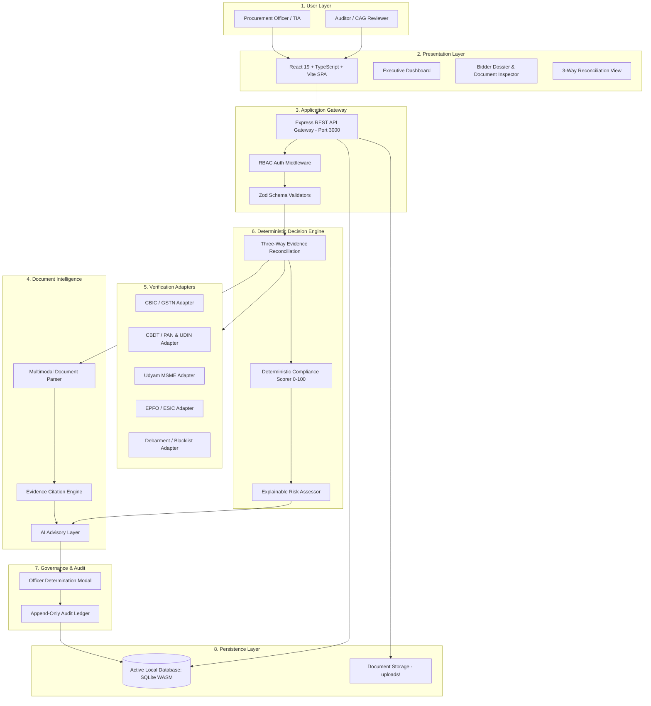

# GEV-VERIFY (SATYAM)

> **National Public Procurement Compliance Verification & Decision-Support System**  
> *Developed for Smart India Hackathon (SIH 2026 PS 26100) — Government e-Marketplace (GeM) & GFR 2017 Compliance*

[](https://www.typescriptlang.org/)
[](https://react.dev/)
[](https://nodejs.org/)
[](https://expressjs.com/)
[-blue.svg?logo=sqlite)](https://sqlite.org/)
[-purple.svg)](https://ai.google.dev/)
[](https://www.docker.com/)
[](./tests)

---

## Overview

Public procurement evaluations under the **General Financial Rules (GFR 2017)** and **GeM General Terms & Conditions (GTC)** require evaluating thousands of statutory clauses across hundreds of bidder dossiers. Traditional manual verification is burdened by:
- Severe backlog and scrutiny fatigue among Tender Inviting Authorities (TIAs).
- Forged or mismatched statutory certificates (e.g. invalid GSTINs, expired CA UDINs, or unauthorized OEM Authorization codes).
- Cross-document contradictions that escape human review.
- Risks of blacklisted or debarred contractors participating through alter-ego entities.

**GEV-VERIFY (SATYAM)** solves this by introducing **Three-Way Evidence Reconciliation** backed by an audit-grade deterministic compliance engine and citation-grounded AI advisory layer. The platform ensures zero-hallucination document intelligence while preserving the statutory principle that **the Procurement Officer retains 100% final authority**.

---

## Key Capabilities

- **Tender Requirement Intelligence**: Ingests RFP documents, extracts candidate statutory clauses, minimum financial thresholds, and evaluation weights for officer review.
- **AI-Assisted Document Intelligence**: Extracts structured bidder data (GSTIN, PAN, UDIN, turnover, local content %) with verbatim source quotes and page numbers under a strict zero-hallucination policy.
- **Multi-Source Verification**: 13 modular verification adapters query authoritative databases (simulated in prototype) covering CBIC, CBDT, Udyam MSME, EPFO, ESIC, OEM, and CPPP debarment repos.
- **Three-Way Evidence Reconciliation**: Cross-matches bidder documents, external registry records, and tender rules to surface discrepancies instantly.
- **Deterministic Compliance Engine**: Scores bids on a transparent 0–100 scale using mathematical rules. AI cannot modify or inflate compliance scores.
- **Explainable Risk Assessment**: Categorizes dossiers into `LOW`, `MEDIUM`, `HIGH`, or `CRITICAL` risk tiers with explicit clause violation rationales.
- **AI Advisory Layer**: Synthesizes verified findings into natural language advisory memos with statutory citations (GFR Rule 144 / GeM GTC).
- **Human-in-the-Loop Decisions**: Provides mandatory justification workflows for officer approvals, rejections, or 48-hour clarification notices.
- **Audit & Evaluation History**: Append-only audit logging and versioned evaluation snapshots for vigilance and CAG audits.

---

## Core Architecture

GEV-VERIFY is structured into 8 distinct layers ensuring strict separation of concerns:



> For full architectural details, see [docs/architecture.md](./docs/architecture.md) and the enterprise vector diagram at [docs/assets/architecture.svg](./docs/assets/architecture.svg).

---

## The Primary USP: Three-Way Evidence Reconciliation

Unlike conventional OCR or isolated API lookup tools, GEV-VERIFY performs a synchronized tri-party cross-verification:

$$\text{Bidder Document Evidence} \;\oplus\; \text{External Verification Source} \;\oplus\; \text{Tender Requirement} \;=\; \mathbf{Reconciled\;Compliance\;Finding}$$

```
┌──────────────────────────────┐     ┌──────────────────────────────┐
│  LAYER 1: BIDDER EVIDENCE    │     │  LAYER 2: VERIFICATION SOURCE │
│  - Extracted Legal Name      │     │  - Authoritative Registry    │
│  - Extracted GSTIN / PAN     │     │  - Active Filing Status      │
│  - Stated Financial Turnover │     │  - Portal Address / MSME Tier│
└──────────────┬───────────────┘     └──────────────┬───────────────┘
               │                                    │
               └─────────────────┬──────────────────┘
                                 ▼
              ┌─────────────────────────────────────┐
              │     THREE-WAY RECONCILIATION        │
              │  - Detects data contradictions      │
              │  - Validates threshold compliance   │
              │  - Flags blacklisted tax IDs        │
              └──────────────────┬──────────────────┘
                                 ▲
               ┌─────────────────┴──────────────────┐
               │  LAYER 3: TENDER REQUIREMENT RULES │
               │  - GFR Rule 144(xi) Land Border    │
               │  - Make-in-India Local Content %   │
               │  - Mandatory Minimum Turnover      │
               └────────────────────────────────────┘
```

### Secondary USPs
1. **AI + Deterministic Compliance Separation**: Scores are computed mathematically (0–100); AI models cannot inflate or alter scores.
2. **Tender-Aware Policy Evaluation**: Each check is weighted against the specific tender's published criteria.
3. **Evidence Provenance**: Every extracted field links directly to source document page numbers and verbatim text snippets.
4. **Cross-Document Consistency Detection**: Detects inter-document contradictions (e.g., PAN embedded in GSTIN differing from uploaded PAN card).
5. **Explainable Risk Assessment**: Provides clear audit trails of why a bidder is classified as `HIGH` or `CRITICAL` risk.
6. **Human-in-the-Loop Governance**: Mandatory justification prompts ensure legal defensibility before any officer override.
7. **Modular Verification Adapters**: Pluggable adapter interface supporting 13 statutory registries.

---

## Technology Stack

| Layer | Technologies | Role / Responsibility |
| :--- | :--- | :--- |
| **Frontend UI** | React 19, TypeScript, Vite 6, TailwindCSS 4, Lucide React, Recharts | High-performance SPA with tri-layer inspector & charts |
| **Backend API** | Node.js (v20+ / v24+), Express 4.21, TypeScript, Zod | Gateway routing, RBAC auth, file uploads, OpenAPI 3.0 |
| **Active Local DB** | SQLite via `sql.js` (WebAssembly) | Embedded local persistence (`data/gev_verify.sqlite`) |
| **Production DB** | PostgreSQL 16 + Prisma ORM (pgvector ready) | Optional containerized database deployment target |
| **Document AI** | Google Gemini (via `@google/genai`) + Structured Fallback | Multimodal statutory parsing & advisory generation |
| **AI Intelligence Service** | Python 3.11+, FastAPI, Uvicorn, Pydantic | Optional standalone microservice on port 8001 |
| **Observability** | Pino, Pino-Pretty | Structured JSON logging with credential redaction |
| **Testing** | Custom Monorepo Test Runner via `tsx` | 7 automated unit, contract, and end-to-end suites |

---

## Repository Structure

```
Satyam/
├── apps/
│   └── api/                    # Domain controllers and repositories
├── data/
│   └── gev_verify.sqlite       # Pre-seeded active SQLite local database
├── docs/
│   ├── assets/                 # Architecture SVG diagrams
│   ├── architecture.md         # Detailed architectural specification
│   ├── DEMO_GUIDE.md           # 14-step live evaluation demonstration guide
│   ├── SECURITY.md             # Security policy, RBAC, and governance
│   └── screenshots/            # Application interface captures
├── infrastructure/
│   ├── docker-compose.yml      # Containerized deployment manifest
│   ├── Dockerfile              # Production multi-stage build Dockerfile
│   └── nginx.conf              # Reverse proxy configuration
├── packages/
│   ├── compliance-core/        # Deterministic policy engine & scoring algorithms
│   ├── config/                 # Shared platform constants & scoring thresholds
│   ├── shared-types/           # Shared TypeScript domain interfaces
│   └── validation/             # Zod schemas for input validation
├── prisma/
│   └── schema.prisma           # Prisma schema for PostgreSQL production target
├── scripts/
│   └── capture-screenshots.mjs # Automated Playwright screenshot utility
├── server/
│   ├── complianceEngine.ts     # Deterministic GFR 2017 policy evaluation rules
│   ├── consistencyEngine.ts    # Cross-document consistency verification
│   ├── crossVerificationEngine.ts # Three-way reconciliation logic
│   ├── db.ts                   # SQLite wasm database access & auto-seeding
│   ├── gemini.ts               # Document intelligence & AI advisory with fallback
│   ├── routes.ts               # Express REST API gateway routes
│   └── verificationSimulators.ts # Statutory registry simulators
├── services/
│   └── ai-intelligence/        # Optional Python FastAPI AI microservice (port 8001)
├── src/                        # React 19 client application (SPA)
├── tests/                      # Automated test suite (65 passing tests)
├── .env.example                # Sanitized configuration template
├── package.json                # Monorepo configuration & npm scripts
├── server.ts                   # Unified Express + Vite development server
├── tsconfig.json               # Monorepo path aliases & compiler options
└── vite.config.ts              # Clean Vite build configuration
```

---

## Prerequisites

Before running the project locally:
- **Node.js**: v20.x, v22.x, or v24.x LTS (tested on `v24.15.0`)
- **npm**: v10+ (or **Bun** v1.2+)
- **Python**: v3.10+ (only required if running the optional Python AI microservice)
- **Git**
- *(Optional)* **Docker & Docker Compose**: Only needed if testing containerized PostgreSQL deployment.
- *(Optional)* **Gemini API Key**: Only needed if live Google GenAI model calls are desired. The application runs with 100% functionality offline using its built-in deterministic fallback engine.

> **Note**: PostgreSQL is **not** required for local development. The application runs immediately out of the box using embedded SQLite.

---

## Environment Configuration

1. Copy `.env.example` to create your local `.env`:
   ```powershell
   Copy-Item .env.example .env
   ```
2. *(Optional)* Add your Gemini API key in `.env` if you wish to run live multimodal extractions:
   ```env
   GEMINI_API_KEY=your_actual_gemini_api_key_here
   ```
   *If left blank, GEV-VERIFY will seamlessly operate using its deterministic parsing and advisory rules.*

---

## Local Installation

Clone the repository and install all workspace dependencies:

```powershell
# 1. Clone repository
git clone https://github.com/maitray-agrawal/Satyam.git
cd Satyam

# 2. Install monorepo dependencies
# With npm (using legacy peer deps for React 19 compatibility):
npm install --legacy-peer-deps

# Or with Bun:
bun install
```

---

## Run the Application

Start the unified full-stack development server:

```powershell
npm run dev
```

*Expected Output:*
```text
[SATYAM] Government Procurement Verification Platform running on http://0.0.0.0:3000
Vite server ready in ... ms
```

Open your browser to: **`http://localhost:3000`**  
Verify API health check: **`http://localhost:3000/api/health`**

---

## Optional: Run Python AI Intelligence Service

If you wish to run the standalone Python FastAPI microservice:

```powershell
cd services/ai-intelligence
python -m venv .venv
.\.venv\Scripts\Activate.ps1
pip install -r requirements.txt
python main.py
```

*Microservice runs on:* **`http://localhost:8001`**  
*Health endpoint:* **`http://localhost:8001/health`**

---

## Testing & Verification

GEV-VERIFY includes a comprehensive automated test runner verifying compliance rules, Zod schemas, OpenAPI contracts, reconciliation algorithms, consistency checks, adapters, and demo scenarios.

```powershell
# 1. Execute full automated test suite
npm test

# 2. Run TypeScript static type checking
npm run lint

# 3. Test production build compilation
npm run build
```

### Verified Test Results (Commit `95c1266` Sanitized)
```text
====================================================
  SATYAM MONOREPO AUTOMATED TEST SUITE (SIH 2026 PS 26100)
====================================================
--- 1. Compliance Core & Policy Engine Tests (6 tests)
  PASS: PolicyEngine: GST rule should evaluate to COMPLIANT when verified
  PASS: PolicyEngine: GST rule score should equal requirement weight
  PASS: PolicyEngine: Debarment rule should evaluate to NON_COMPLIANT on blacklisted entity
  PASS: PolicyEngine: Debarment rule score should be 0
  PASS: ComplianceScorer: Normalized score calculation (20 / 40 * 100 = 50)
  PASS: ComplianceScorer: Critical debarment violation triggers CRITICAL risk level

--- 2. Zod Domain Validation Tests (3 tests)
  PASS: Validation: CreateBidSchema parses valid Indian GSTIN & PAN
  PASS: Validation: CreateBidSchema rejects invalid GSTIN format
  PASS: Validation: OfficerDecisionSchema requires min 10 chars statutory justification

--- 3. OpenAPI 3.0 Contract Tests (7 tests)
  PASS: Contract: OpenAPI specification version is 3.0.3
  PASS: Contract: /tenders endpoint defined in schema
  PASS: Contract: /bids/{id} endpoint defined in schema
  PASS: Contract: /bids/{id}/decision endpoint defined in schema
  PASS: Contract: /verification/adapters endpoint defined in schema
  PASS: Contract: OpenAPI specification title is defined
  PASS: Contract: API server URL configured

--- 4. Three-Way Reconciliation Engine Tests (9 tests)
  PASS: Reconciliation: Generated reconciliation matrix for all 4 requirements
  PASS: Reconciliation: Found GST reconciliation item
  PASS: Reconciliation: GST outcome is COMPLIANT
  PASS: Reconciliation: GST Document evidence presence is true
  PASS: Reconciliation: Extracted GSTIN matches
  PASS: Reconciliation: Verification evidence simulated flag is preserved
  PASS: Reconciliation: Found missing OEM requirement
  PASS: Reconciliation: Missing mandatory doc evaluated as MISSING_EVIDENCE
  PASS: Reconciliation: Missing mandatory doc triggers CRITICAL severity
  PASS: Reconciliation: Missing mandatory doc receives 0 score
  PASS: Reconciliation: Make in India (65% >= 50%) is COMPLIANT

--- 5. Cross-Document Consistency Engine Tests (8 tests)
  PASS: Consistency: Clean documents achieve 100 consistency score
  PASS: Consistency: Clean verdict is CONSISTENT
  PASS: Consistency: 0 inconsistencies in clean dossier
  PASS: Consistency: Multiple verified cross-document matches recorded
  PASS: Consistency: Flags contradiction between GSTIN-embedded PAN and PAN card
  PASS: Consistency: Found PAN field inconsistency item
  PASS: Consistency: Contradicting PAN numbers flag as HIGH_RISK_REVIEW severity
  PASS: Consistency: Score is penalized for contradiction

--- 6. Statutory Verification Adapters Tests (13 tests)
  PASS: Verification Registry: At least 13 adapters registered (actual: 13)
  PASS: Verification Registry: GST adapter found
  PASS: GST Adapter: Returns simulated: true flag
  PASS: GST Adapter: Includes simulation notice
  PASS: GST Adapter: Active GSTIN matches as VERIFIED
  PASS: Verification Registry: PAN adapter found
  PASS: PAN Adapter: Returns VERIFIED status for valid PAN
  PASS: Verification Registry: Debarment/Blacklist adapter found
  PASS: Blacklist Adapter: Non-blacklisted entity returns VERIFIED clean
  PASS: Blacklist Adapter: Blacklisted entity returns FLAGGED status
  PASS: Blacklist Adapter: isBlacklisted flag is true
  PASS: Verification Registry: Make In India adapter found
  PASS: Verification Registry: Udyam MSME adapter found

--- 7. End-to-End Demo Scenarios Verification Tests (19 tests)
  PASS: Demo Scenario 1: Bid-1 (TechVanguard) exists in database
  PASS: Demo Scenario 1: TechVanguard has LOW risk level (actual: LOW)
  PASS: Demo Scenario 1: TechVanguard score >= 90 (actual: 100)
  PASS: Demo Scenario 1: TechVanguard all checks COMPLIANT or EXEMPTED
  PASS: Demo Scenario 2: Bid-2 (Apex Infotech) exists in database
  PASS: Demo Scenario 2: Apex Infotech has elevated risk (actual: HIGH)
  PASS: Demo Scenario 2: OEM authorization check flagged (actual: NON_COMPLIANT)
  PASS: Demo Scenario 3: Bid-3 (Bharat Electro) exists in database
  PASS: Demo Scenario 3: Bharat Electro has HIGH or CRITICAL risk (actual: HIGH)
  PASS: Demo Scenario 3: Make in India check flagged (actual: NON_COMPLIANT)
  PASS: Demo Scenario 4: Bid-4 (Global Quantum) exists in database
  PASS: Demo Scenario 4: Global Quantum has CRITICAL risk level (actual: CRITICAL)
  PASS: Demo Scenario 4: Debarment penalty caps score <= 18 (actual: 5)
  PASS: Demo Scenario 4: Blacklisting check evaluated as NON_COMPLIANT
  PASS: Demo Scenario 4: Critical debarment flag captured in risk assessment
  PASS: Demo Scenario 5: Bid-7 (Surya Solar) exists in database
  PASS: Demo Scenario 5: Startup India check is recognized (actual: COMPLIANT)
====================================================
  TOTAL: 65 | PASSED: 65 | FAILED: 0
====================================================
```

---

## Live Demonstration Sequence

For a structured walkthrough during jury evaluation, follow the sequence documented in [docs/DEMO_GUIDE.md](./docs/DEMO_GUIDE.md):

1. **Executive Dashboard**: Review tender metrics, active risk flags, and statutory SLA tracker.
2. **Tender Selection**: Select Tender `GEM/2026/B/948210` and inspect statutory clauses.
3. **Open Bidder Dossier**: Open Bidder `bid-2` (Apex Infotech) or `bid-3` (Bharat Electro-Tech).
4. **Document Inspection**: Inspect uploaded GST/PAN/OEM certificates in Subtab 2.
5. **Extracted Evidence**: Examine verified field extractions with verbatim source citations.
6. **Third-Party Registries**: Review the 13 simulated statutory portal verification records in Subtab 3.
7. **Three-Way Reconciliation**: Switch to Subtab 4 to observe side-by-side tri-party cross-checks.
8. **Discrepancy Detection**: Observe real-time mismatch alerts for invalid OEM codes or low local content.
9. **Deterministic Score**: Verify the mathematically calculated score (0–100) based strictly on rules.
10. **Explainable Risk Assessment**: Inspect the assigned risk level (`HIGH`/`CRITICAL`) and statutory clause flags.
11. **AI Advisory Recommendation**: Review the advisory guidance memo and prominent legal disclaimer.
12. **Procurement Officer Determination**: Record an official determination with mandatory written justification.
13. **Audit Ledger**: Verify the immutable event entry recorded in the audit trail.
14. **Generate Report**: Produce an audit-grade printable summary report for the Tender Inviting Authority.

---

## UI Captures & Screenshots

Screenshots of the running application are saved in [docs/screenshots/](./docs/screenshots/):
- `dashboard.png` — Executive Dashboard with portfolio risk metrics.
- `bidder-dossier.png` — Comprehensive Bidder Dossier Inspector with document citations.
- `three-way-reconciliation.png` — Side-by-side tri-party evidence comparison matrix.
- `audit-ledger.png` — Append-only governance audit log.

To capture fresh high-resolution screenshots from your local dev server:
```powershell
npm install -D playwright
npx playwright install chromium
node scripts/capture-screenshots.mjs
```

---

## Security & Governance

For full security specifications, refer to [docs/SECURITY.md](./docs/SECURITY.md). Key security implementations include:
- **No Hardcoded Secrets**: All environment variables use dynamic expansion or placeholders.
- **RBAC Middleware**: Enforced access control for `PROCUREMENT_OFFICER`, `ADMIN`, `AUDITOR`, and `REVIEWER`.
- **Sensitive Field Redaction**: Automatic logging redaction of passwords, tokens, and API keys.
- **Tamper-Evident Hashing**: SHA-256 cryptographic hashing of all uploaded bidder documents upon ingestion.

---

## Current Prototype Limitations

In adherence to technical truthfulness:
1. **Simulated Government Registries**: Third-party verification sources (GSTN, CBDT, Udyam, EPFO, ESIC, CPPP) use realistic simulation adapters in the prototype. Production deployment requires integration with authenticated NIC / API Setu gateways.
2. **Local Persistence Layer**: The active prototype persists to local SQLite (`data/gev_verify.sqlite`) via `sql.js`. A production Prisma schema for PostgreSQL with `pgvector` is provided for containerized deployment.
3. **Optional External AI**: The multimodal OCR and advisory features use Google Gemini when configured, but automatically fallback to deterministic parsing and scoring rules when offline.
4. **Advisory Decision Support Only**: The system does not make autonomous procurement awards; the authorized Procurement Officer retains legal responsibility.

---

## Product Roadmap

- **Phase 1: SIH 2026 Prototype (Current)**
  - Three-Way Evidence Reconciliation engine.
  - Deterministic GFR 2017 compliance policy scorer.
  - 13 pluggable statutory verification simulators.
  - Citation-grounded AI advisory layer with offline fallback.
  - Complete 65-test automated verification suite.

- **Phase 2: Controlled Pilot**
  - Direct integration with Open API Setu and GeM sandbox environments.
  - PostgreSQL + pgvector persistence migration.
  - Distributed background job processing for high-volume multi-gigabyte RFP dossiers.
  - Digital signature certificate (DSC) Class-3 token hardware validation.

- **Phase 3: Production Nationwide Scale**
  - Multi-tenant deployment across central and state procurement departments.
  - Continuous registry polling for post-award debarment monitoring.
  - Automated integration with GeM contract award and financial opening modules.

---

## License

Licensing terms for the GEV-VERIFY (SATYAM) repository are currently unspecified. Contact the project maintainers for institutional evaluation and usage permissions.
