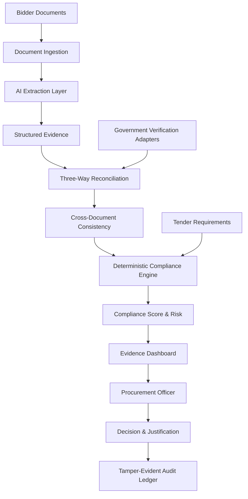

# SATYAM
Smart Audit & Trust Analytics for GeM Procurement

## Problem Statement
SIH26100 — AI-Powered Integrated Bid Compliance Verification Platform for GeM Procurement

[](https://www.typescriptlang.org/)
[](https://react.dev/)
[](https://nodejs.org/)
[](https://expressjs.com/)
[](./server/db.ts)
[](./tests)
[-success.svg)](./dist)

---

## Executive Overview

**SATYAM** (*Smart Audit & Trust Analytics for GeM Procurement*) is an enterprise-grade bid compliance verification and decision-support platform designed for the **Government e-Marketplace (GeM)** under Problem Statement **SIH26100**.

Public procurement in India involves strict adherence to the **General Financial Rules (GFR 2017)**, **GeM General Terms & Conditions (GTC)**, and **CVC guidelines**. Tender Inviting Authorities (TIAs) must scrutinize high volumes of technical and commercial documents within tight statutory deadlines. SATYAM resolves the dual challenges of evaluation backlogs and procurement fraud through an architecturally decoupled system:
1. **AI Extraction & Advisory Layer**: Ingests multi-format bidder documents and synthesizes advisory guidance without exercising autonomous executive decision-making.
2. **Deterministic Policy Engine**: Computes reproducible, mathematical compliance scores (0–100) and risk classifications based on versioned rulesets.
3. **Statutory Registry Verification**: Validates claims against structured registry adapters (GST, PAN, MSME, EPFO, ESIC, MCA, Make in India, and central debarment lists).
4. **Human-in-the-Loop Governance**: Retains exclusive decision authority with the authorized Procurement Officer, requiring mandatory statutory justifications under GFR Rule 144.
5. **Tamper-Evident Cryptographic Ledger**: Guarantees non-repudiation and forensic auditability via backward-chained SHA-256 event blocks.

---

## Problem

Under conventional public procurement operations, tender evaluation committees face critical operational vulnerabilities:

1. **Scrutiny Backlog & Human Fatigue**: Manual verification of 50+ page technical submissions across hundreds of bidders leads to delayed tender finalizations, extended bid validity requirements, and human oversight.
2. **Fraudulent & Forged Certificates**: Fabricated CA UDIN credentials, altered audited financial turnover statements, invalid GSTINs, and forged Manufacturer Authorization Forms (MAFs) evade manual detection.
3. **Cross-Document Contradictions**: Hidden discrepancies—such as a PAN embedded within a GSTIN not matching the standalone PAN card, or legal names differing between Udyam and incorporation certificates—are rarely caught across disparate annexures.
4. **Debarred & Blacklisted Entities**: Ineligible or debarred vendors circumvent exclusion lists by participating under sister concerns, modified trade names, or shell entities in violation of GFR Rule 151 and Rule 175.
5. **Lack of Explainable Audit Trails**: Disqualification challenges raised before judicial or administrative review tribunals often fail due to the absence of verifiable, time-stamped, tamper-evident evidence trails.

---

## Solution

SATYAM provides an integrated, evidence-grounded verification platform that transforms unstructured tender documents into verifiable statutory facts.

### Core Architectural Invariant
SATYAM enforces strict operational boundaries between probabilistic artificial intelligence, deterministic policy evaluation, and executive human judgment:

- **AI does NOT compute compliance scores.**
- **AI does NOT qualify or disqualify bidders.**
- **AI does NOT override statutory rules.**

```
DOCUMENTS
   ↓
EXTRACTION / ADVISORY LAYER
   ↓
STRUCTURED EVIDENCE FACTS
   ↓
THREE-WAY RECONCILIATION & CONSISTENCY CHECK
   ↓
DETERMINISTIC COMPLIANCE ENGINE (Policy-as-Code)
   ↓
COMPLIANCE SCORE (0-100) & RISK TIER
   ↓
PROCUREMENT OFFICER (Human-in-the-Loop Decision & Justification)
   ↓
TAMPER-EVIDENT AUDIT LEDGER (SHA-256 Hash Chain)
```

---

## Key Capabilities

- **Multi-Document Bid Analysis**: Ingests and processes multi-page PDFs, technical specifications, balance sheets, CA certificates, and OEM declarations.
- **Government Registry Verification Architecture**: Pluggable verification subsystem supporting 13 statutory domains with explicit separation of simulation testbeds and live production endpoints.
- **Three-Way Reconciliation**: Evaluates every requirement simultaneously across three vectors: (1) Tender RFP Mandate, (2) Bidder Extracted Claim, and (3) Independent Statutory Verification.
- **Cross-Document Consistency**: Detects semantic and identity contradictions across dossier components, including GSTIN-PAN checksum alignment, entity legal name matching, and incorporation date coherence.
- **Deterministic Compliance Engine**: Pure Policy-as-Code rules evaluating GFR 2017 conditions without probabilistic drift or hallucination risks.
- **Risk Scoring**: Mathematically bounded 0–100 scoring with automated severity escalation (LOW, MEDIUM, HIGH, CRITICAL).
- **Explainable Evidence**: Granular provenance trails displaying source document name, SHA-256 hash, page number, verbatim clause excerpt, and extraction confidence.
- **Human-in-the-Loop Decision Workflow**: Statutory decision interface requiring authorized procurement officers to record official designations, mandatory legal justifications, and procurement conditions.
- **Tamper-Evident Audit Trail**: Cryptographically chained SHA-256 event ledger guaranteeing full forensic integrity and detection of database-level tampering.
- **Offline Demo Mode**: Self-contained deterministic fallback engine operating completely offline without external cloud dependencies or API keys.

---

## Architecture



### Architectural Responsibilities

| Subsystem | Primary Role | Implementation Files |
|---|---|---|
| **AI Extraction Layer** | Multimodal OCR, key-value extraction, clause mapping, advisory summaries | `server/ai/` |
| **Verification Subsystem** | Queries statutory registries via standardized adapter interface | `server/integrations/verification/` |
| **Reconciliation Engine** | Compares Tender Mandate vs Bid Evidence vs Registry Data | `server/reconciliationService.ts` |
| **Consistency Engine** | Cross-references inter-document identifiers (PAN, GSTIN, Names) | `server/consistencyService.ts` |
| **Compliance Engine** | Deterministically applies GFR procurement rules and computes scores | `server/complianceCore.ts`, `server/rules/` |
| **Audit Subsystem** | Records SHA-256 backward-linked event logs for non-repudiation | `server/db.ts` |
| **Human Interface** | Web dashboard for evidence inspection and officer decision logging | `src/components/`, `src/App.tsx` |

---

## Government Integration Transparency

> [!IMPORTANT]
> **Mandatory Integration Disclosure**:  
> Government registry integrations in this demonstration use controlled simulation adapters. Production deployment would require authorized credentials, API agreements, security controls, and connectivity to the respective government systems.

### Registry Adapter Specification

| Registry | Current Demo Mode | Production API Architecture | Data Points Validated |
|---|---|---|---|
| **GSTN (Taxation)** | Controlled Simulation Adapter | Sandbox / GSP OAuth2 Gateway | Active GSTIN status, taxpayer type, return filing currency |
| **CBDT / NSDL (PAN)** | Controlled Simulation Adapter | NSDL Verification API | PAN validity, legal entity name match, entity type |
| **Udyam (MSME)** | Controlled Simulation Adapter | Ministry of MSME Verification API | Udyam Registration Number, enterprise classification (Micro/Small/Medium) |
| **CPPP / GeM Debarment** | Controlled Simulation Adapter | CPPP Central Debarment Database | Exclusion status, debarment order reference, effective dates |
| **MCA21 (ROC)** | Controlled Simulation Adapter | MCA V3 API Gateway | CIN, incorporation date, active company status |
| **DPIIT (Make in India)** | Controlled Simulation Adapter | DPIIT Local Content Verification Portal | Local content declaration percentage (Class-I / Class-II) |
| **EPFO & ESIC** | Controlled Simulation Adapter | Shram Suvidha Unified Portal API | Establishment code, active statutory employee contributions |
| **OEM Verification** | Controlled Simulation Adapter | Direct OEM API / Public Cryptographic Key | MAF authorization code, validity date, tender authorization scope |

All simulation responses return `{ simulated: true, simulationNotice: "..." }` to maintain complete audit transparency during demonstration.

---

## Deterministic Compliance Scoring

Compliance scoring is strictly mathematical and deterministic.

### Mathematical Formulation
The Overall Compliance Score is derived as:

$$\text{Score} = \text{round}\left( \frac{\sum_{i=1}^{n} \text{Points Awarded}_i}{\sum_{i=1}^{n} \text{Requirement Weight}_i} \times 100 \right)$$

### Rules & Safeguards
1. **0–100 Bounding**: Scores are bounded strictly between 0 and 100.
2. **Normalized Weights**: Each tender clause is assigned a statutory weight (e.g., GST: 20, Experience: 20, Turnover: 20, Debarment: 20, Make in India: 20).
3. **Critical Escalation Ceiling**: If a critical statutory violation occurs (e.g., debarment on CPPP/GeM), the bidder's risk tier is automatically set to `CRITICAL` and the compliance score is capped at $\le 18$.
4. **Missing Evidence Handling**: Missing mandatory documents are never assumed to be valid; they receive 0 points and evaluate to `MISSING_EVIDENCE`.
5. **Special Exemptions**: Valid Startup India (DPIIT) and MSE (Udyam) credentials trigger automatic clause exemptions on Prior Experience and Prior Turnover under GFR Rule 153 and Rule 173(i), awarding full compliance points without penalty.

---

## Security & Access Control

- **HTTP Security Headers**: Enforces `X-Content-Type-Options: nosniff`, `X-Frame-Options: DENY`, `X-XSS-Protection: 1; mode=block`, and `Strict-Transport-Security`.
- **Role-Based Access Control (RBAC)**: Enforces role boundaries (`BIDDER`, `PROCUREMENT_OFFICER`, `AUDITOR`, `ADMIN`). Mutating endpoints (decision logging, tender ruleset updates) require authenticated `PROCUREMENT_OFFICER` or `ADMIN` roles.
- **Upload Validation & Path Sanitization**: Multi-layer upload security verifying MIME types, whitelisting file extensions (`.pdf`, `.png`, `.jpg`, `.jpeg`), and sanitizing filenames with `path.basename` to prevent path traversal attacks.
- **Information Leakage Prevention**: Detailed server stack traces are suppressed from client responses.

---

## Tamper-Evident Audit Ledger

SATYAM implements a backward-linked SHA-256 cryptographic audit chain:

- **Genesis Block**: Root hash initialized as `GENESIS`.
- **Chained Hashing**: Each subsequent audit entry computes:
  $$\text{Hash}_N = \text{SHA-256}(\text{Hash}_{N-1} \parallel \text{ID} \parallel \text{EventType} \parallel \text{ActorName} \parallel \text{ActorRole} \parallel \text{Timestamp} \parallel \text{Payload})$$
- **On-Demand Ledger Verification**: The `/api/audit-logs/verify` endpoint recalculates and verifies the cryptographic chain from genesis to head. If any database record is directly modified or deleted, the verification detects the break and pinpoints the exact compromised record index.

---

## Demonstration Scenarios

The pre-seeded demonstration environment includes 5 standard scenarios reflecting realistic procurement evaluations:

1. **Scenario 1 — Fully Compliant Bidder (TechVanguard Solutions)**  
   - Valid GSTIN, verified PAN, Class-I Local Content (65%), active OEM MAF, clean debarment status.  
   - Result: Score: 100/100 | Risk: `LOW` | Pre-seeded Officer Decision: `QUALIFIED`.
2. **Scenario 2 — OEM Authorization Discrepancy (Apex Infotech)**  
   - Valid tax credentials, but OEM authorization code is invalid or missing verification.  
   - Result: Score: 85/100 | Risk: `HIGH` | Status: Requires clarification under GeM shortfall procedure.
3. **Scenario 3 — Make in India Local Content Shortfall (Bharat Electro Systems)**  
   - Bidding on a Class-I mandatory tender (min 50% local content), but declares only 38%.  
   - Result: Score: 68/100 | Risk: `HIGH` | Discrepancy: Ineligible for purchase preference under PPP-MII Order 2017.
4. **Scenario 4 — Debarred / Blacklisted Entity (Global Quantum Networks)**  
   - Entity found on central CPPP/GeM debarment registry for past contractual defaults.  
   - Result: Score: 5/100 | Risk: `CRITICAL` | Status: Recommended for immediate disqualification under GFR Rule 151.
5. **Scenario 5 — Startup India / MSME Statutory Exemption (Surya Solar Systems)**  
   - Early-stage enterprise with verified DPIIT Startup certificate and Udyam registration.  
   - Result: Turnover and Prior Experience clauses evaluated as `EXEMPTED` under GFR Rule 153/173 | Risk: `LOW`.

---

## Offline Demo Mode

SATYAM includes an integrated **Deterministic Fallback Provider** (`server/ai/providers/fallback.provider.ts`).

- **No Internet Required**: All document extraction, rule evaluation, reconciliation, scoring, and UI workflows operate completely offline.
- **No API Keys Required**: When `GEMINI_API_KEY` is not present, the system automatically uses deterministic rule-based extraction and template-grounded advisory formulation.
- **Zero Hallucinations**: Offline mode produces reliable, reproducible results during live evaluations.

---

## Quickstart & Verification

### 1. Prerequisites
- Node.js 20+ installed
- npm 10+ installed

### 2. Installation
```bash
# Clone the repository
git clone <repo-url>
cd Satyam

# Install dependencies using clean install
npm ci
```

### 3. Run Automated Verification Tests
Run the comprehensive test suite (82 automated tests across 8 suites):
```bash
npm test
```
*Expected Output: `TOTAL: 82 | PASSED: 82 | FAILED: 0`*

### 4. Build for Production
```bash
npm run build
```
*Builds the Vite frontend bundle (`dist/`) and bundles the backend server (`dist/server.cjs`).*

### 5. Start the Production Server
```bash
npm start
```
The platform will bind to `0.0.0.0:3000` (or the port specified via `PORT` environment variable).

### Key Verification Endpoints

| Endpoint | Method | Purpose |
|---|:---:|---|
| `/api/health` | `GET` | Platform health, service name, and version status |
| `/api/tenders` | `GET` | List seeded procurement tenders |
| `/api/verification/adapters` | `GET` | Enumeration of all 13 statutory verification adapters |
| `/api/audit-logs/verify` | `GET` | Cryptographic SHA-256 audit ledger integrity verification |
| `/` | `GET` | Production single-page application (SPA) dashboard |

---

## Regulatory & Legal Alignment

SATYAM is built in strict alignment with Indian public procurement governance frameworks:

- **GFR 2017 Rule 144**: Fundamental principles of public procurement (efficiency, economy, transparency).
- **GFR 2017 Rule 149**: Mandatory procurement through the GeM portal.
- **GFR 2017 Rule 151**: Debarment from bidding for integrity or contractual violations.
- **GFR 2017 Rule 153 & 173(i)**: Mandatory purchase preference and exemptions for MSEs and Startups.
- **Public Procurement (Preference to Make in India) Order 2017**: Local content classification and purchase preference enforcement.
- **CVC Guidelines**: Prevention of arbitrary disqualifications through auditable, evidence-backed evaluation records.
