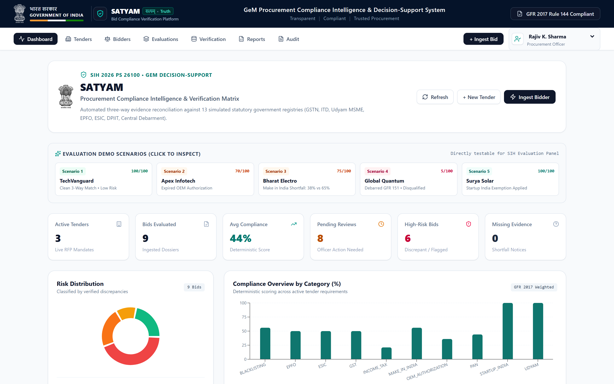
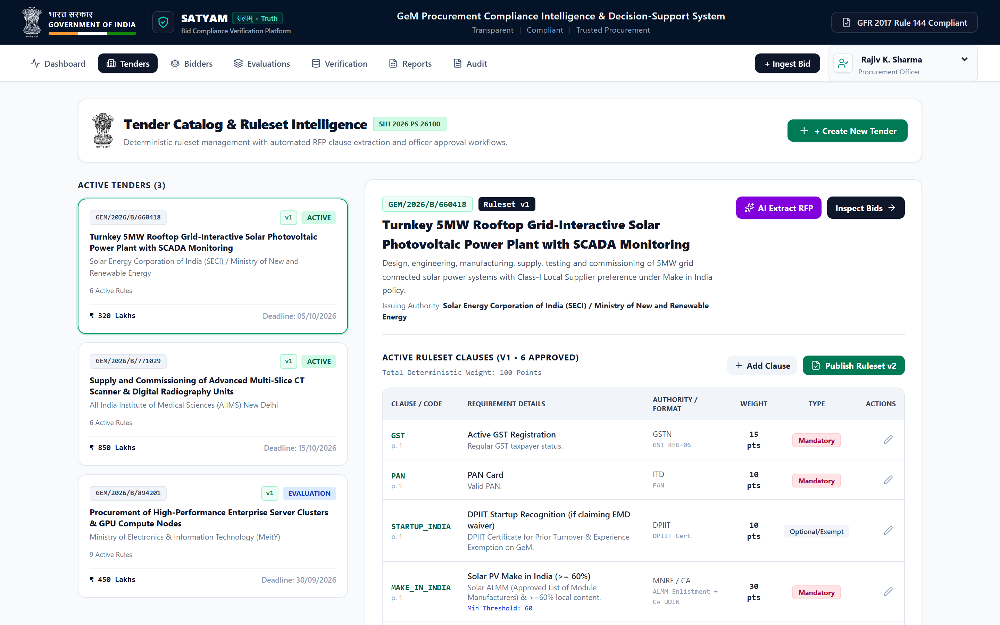
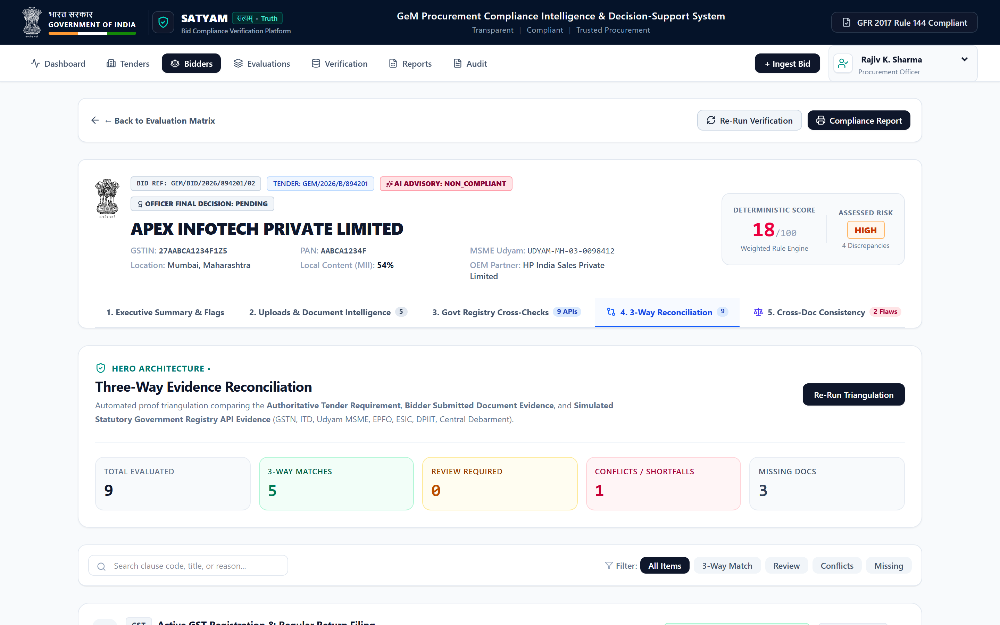
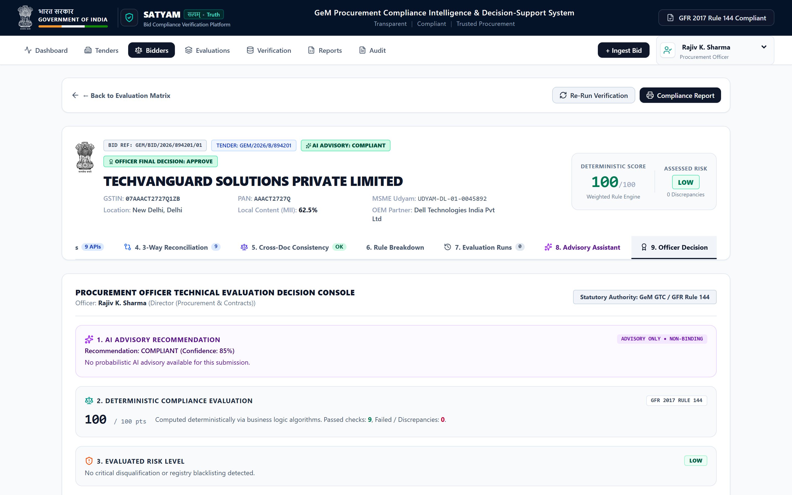
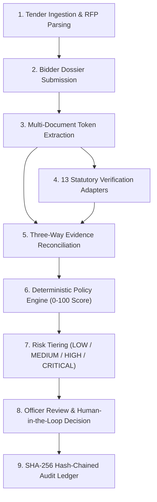
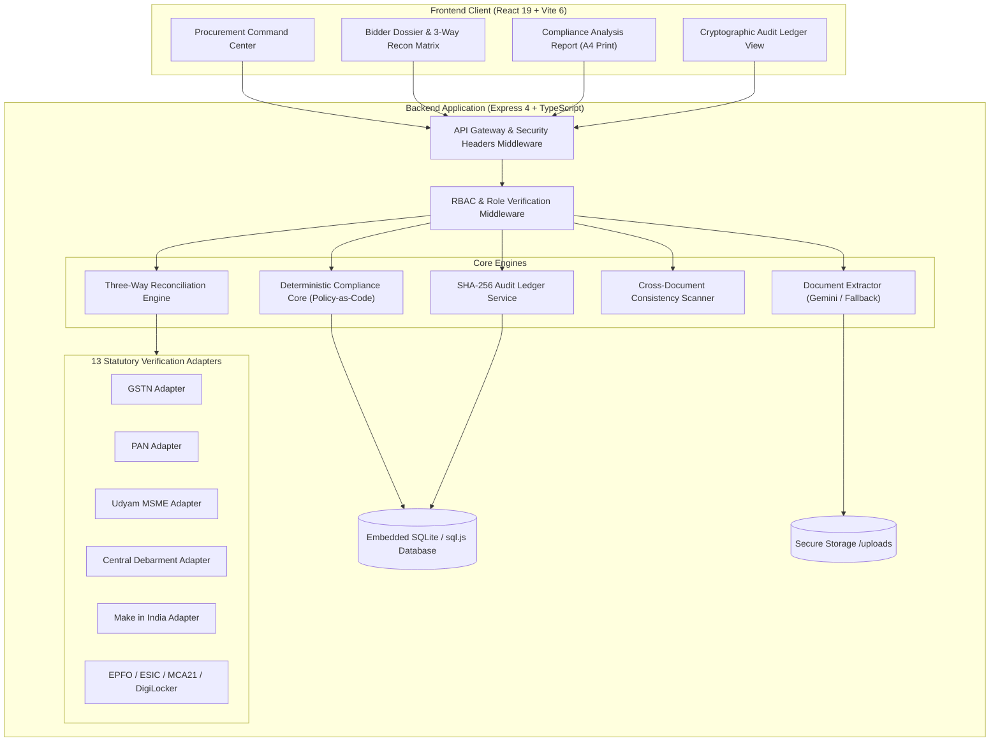

# SATYAM

### Truth • Transparency • Trust in Public Procurement

> **SATYAM** (*सत्यम्*) is an evidence-driven, policy-as-code bid compliance verification and decision-support platform engineered for the Government e-Marketplace (GeM) ecosystem under General Financial Rules (GFR 2017) Rule 144.

[](https://github.com/maitray-agrawal/Satyam)
[-emerald.svg)](./docs/audit/test-report.md)
[](./Dockerfile)
[](https://www.typescriptlang.org/)
[](./LICENSE)
[](https://satyam-app.onrender.com/)

---

## Problem Statement

**Smart India Hackathon (SIH 2026) — Problem Statement SIH26100**
*"AI-Powered Integrated Bid Compliance Verification Platform for GeM Procurement"*

In government procurement across GeM and Central Public Procurement Portal (CPPP), evaluation committees face high scrutiny backlogs. Tender evaluation committees (TECs) must verify dozens of complex clauses (GSTN validity, PAN entity matching, Udyam MSME status, Make in India local content declarations, OEM authorization codes, and Central Debarment lists) across hundreds of multi-page technical dossiers within strict statutory deadlines.

Manual scrutiny causes:
1. **Prolonged Tender Cycles**: Weeks of manual document inspection across disparate government portals.
2. **Scrutiny Fatigue & Human Error**: Inadvertent oversight of expired registrations or forged certificates.
3. **Cross-Document Contradictions**: Inability to systematically cross-reference identity tokens (e.g., PAN embedded inside GSTIN vs PAN card vs financial audit reports).
4. **Collusion & Debarment Evasion**: Bidders evading blacklisting through altered trade names or sister consortiums.

---

## Solution

SATYAM automates statutory compliance evaluation through a **deterministic policy-as-code engine**, **multi-document evidence extraction**, and **thirteen (13) statutory verification adapters**. Rather than trusting bidder claims or relying on unexplainable black-box AI scores, SATYAM cross-examines evidence across three independent planes to generate reproducible 0–100 compliance scores, granular risk classifications (`LOW`, `MEDIUM`, `HIGH`, `CRITICAL`), and a cryptographically tamper-evident SHA-256 audit ledger. Final statutory decision authority remains with authorized procurement officers.

---

## Why SATYAM

The core architectural innovation of SATYAM is **Three-Way Evidence Reconciliation**:

$$\begin{aligned}
&\text{1. Tender Requirement} && \text{(Mandated RFP clause, eligibility threshold, minimum local content)} \\
+\quad &\text{2. Bidder Document Evidence} && \text{(OCR-extracted tokens, certificate IDs, declared values, page citations)} \\
+\quad &\text{3. Independent Verification Data} && \text{(Statutory registry status from GSTN, ITD, Udyam, EPFO, Debarment)} \\
\hline
=\quad &\mathbf{Three\text{-}Way\ Evidence\ Reconciliation} && \mathbf{(Cryptographically\ logged\ factual\ determination)}
\end{aligned}$$

If a bidder submits a valid certificate but the statutory registry shows debarment or invalid registration, SATYAM detects the conflict immediately, penalizes the score, and elevates the risk tier with complete evidence provenance.

---

## Key Results (Measured)

All figures below are strictly measured from the codebase and test runs:

| Metric | Result | Source / Verification |
|---|---:|---|
| **Automated Tests** | **82 / 82** | `bun run test` (8 comprehensive test suites) |
| **Test Pass Rate** | **100.0%** | All assertions passing ([Test Report](./docs/audit/test-report.md)) |
| **Test Suite Runtime** | **634.85 ms** | Sub-second test execution ([Performance Report](./docs/audit/performance.md)) |
| **Verification Adapters** | **13 Registered** | GST, PAN, Udyam, EPFO, ESIC, ITR, Startup India, NSIC, OEM, Debarment, MII, MCA21, DigiLocker |
| **Demonstration Scenarios** | **9 Pre-Seeded** | Fully compliant, OEM discrepancy, MII shortfall, Blacklisted, MSME exemption |
| **Audit Ledger Verification** | **PASS (31/31 Logs)** | `GET /api/audit-logs/verify` (Cryptographic SHA-256 chain intact) |
| **TypeScript Typecheck** | **PASS (0 Errors)** | `tsc --noEmit` validation |
| **Production Build** | **PASS (8.34s)** | Client SPA (Vite) + Server CJS bundle (esbuild) |
| **API Health Latency** | **0.98 ms (Median)** | Measured over 5 consecutive requests ([Performance Report](./docs/audit/performance.md)) |

---

## Live Demo

- **Demonstration URL**: [https://satyam-app.onrender.com/](https://satyam-app.onrender.com/)
- **Environment**: *Controlled Demonstration Environment*
- **Default Evaluation Profile**: Director (Procurement & Contracts), Ministry of Electronics & IT (MeitY)

---

## Demo Video

- **Video Walkthrough**: [SATYAM Evaluation Walkthrough (SIH 2026 PS26100)](https://youtu.be/demo-satyam-sih26100)
- Explains end-to-end tender ingestion, automated three-way reconciliation, cross-document inconsistency detection, compliance analysis report printing, and tamper-evident audit ledger verification.

---

## Screenshots

All screenshots below are captured directly from the running production build at 1440×900 Retina resolution:

### 1. Command Center & Procurement Overview

*Central dashboard displaying active GeM tenders, ingested bidder compliance matrix, real-time KPI metrics, and high-priority officer review queue.*

### 2. Tender Catalog & Ruleset Intelligence

*Automated RFP clause extraction and configurable policy-as-code scoring weights under GFR 2017 Rule 144.*

### 3. Bidder Compliance & Verification Dossier

*Comprehensive multi-document dossier aggregating bidder financial metrics, statutory registrations, and compliance checks.*

### 4. Three-Way Evidence Reconciliation

*Automated triangulation comparing tender requirements, bidder document submissions, and independent statutory registry data.*

### 5. Compliance Analysis Report (A4 Print-Ready)

*Official Technical Evaluation Committee (TEC) compliance report featuring bidder particulars, requirement breakdown, Back to Dossier navigation, and print stylesheet.*

### 6. Evidence Provenance & Document Extraction

*Verifiable evidence trail linking compliance findings directly to source document SHA-256 hash, page number, bounding excerpt, and confidence score.*

### 7. Officer Decision & Statutory Justification

*Human-in-the-loop decision interface requiring authenticated officer designation, conditional stipulations, and minimum 10-character statutory justification.*

### 8. Tamper-Evident Cryptographic Audit Ledger

*Forward-chained SHA-256 audit ledger verifying system state transitions from genesis block to current head with instant mathematical verification.*

---

## End-to-End Workflow



---

## Three-Way Reconciliation

In conventional procurement systems, verification is binary and isolated: an officer manually verifies if a PDF is attached. SATYAM executes automated three-way triangulation:

1. **Requirement Plane**: Mandate defined in tender ruleset (e.g. `MII-LOCAL-CONTENT: Minimum 50% for Class-I Local Supplier`).
2. **Bidder Evidence Plane**: Declared value extracted from bidder affidavit (e.g. `Bharat Electro declared local content: 42%`).
3. **External Verification Plane**: Registry data from DPIIT / Class-I verification adapter (`Requires >= 50%`).

**Outcome**: Flagged as `NON_COMPLIANT`, severity `HIGH`, score penalized to `0`, and documented in the reconciliation matrix with exact citations.

---

## Deterministic Compliance Engine

Compliance evaluation in SATYAM is strictly **deterministic policy-as-code**:

- **Mathematical Normalization**:
  $$\text{Normalized Score} = \left( \frac{\sum \text{Earned Weights}}{\sum \text{Applicable Weights}} \right) \times 100$$
- **Mandatory Requirements**: Missing mandatory documents (e.g. OEM Authorization Form) immediately cap or penalize the score and elevate the risk tier.
- **Statutory Exemptions**: Valid MSME (Udyam) or Startup India registrations automatically evaluate exemption clauses (e.g. EMD waiver, prior turnover relaxation) to `EXEMPTED` without penalizing the overall score.
- **Debarment Override**: Entities flagged on the Central Debarment List are assigned `CRITICAL` risk and score capped $\le 18/100$, triggering mandatory disqualification flags.

---

## Evidence & Provenance

Every evaluated check maintains an auditable evidence pointer:
- **Source Document ID & Name**: e.g., `doc-pan-card.pdf`
- **SHA-256 File Hash**: Cryptographic hash verifying document authenticity at upload time
- **Page Number**: Exact document page where the claim was located
- **Text Excerpt**: Verbatim text token extracted from the file
- **Extraction Confidence**: Numerical confidence percentage (e.g., `98.5%`)

---

## Tamper-Evident Audit Ledger

SATYAM records all state-changing operations in a cryptographically forward-chained ledger using SHA-256:

$$\text{Hash}_n = \text{SHA-256}(\text{Hash}_{n-1} \parallel \text{Timestamp} \parallel \text{EventType} \parallel \text{EntityId} \parallel \text{UserId} \parallel \text{UserRole} \parallel \text{ActionSummary} \parallel \text{MetadataJson})$$

### Chain Structure Example
```json
{
  "id": "log-001",
  "previousHash": "GENESIS",
  "currentHash": "a1b2c3d4e5f6...",
  "eventType": "TENDER_CREATED",
  "timestamp": "2026-09-23T10:00:00.000Z",
  "userId": "usr-1",
  "userRole": "PROCUREMENT_OFFICER"
}
```

Any modification, deletion, or reordering of database rows breaks the cryptographic chain and is detected by `GET /api/audit-logs/verify`.

---

## AI Architecture & Governance Boundaries

SATYAM maintains a strict governance boundary between AI assistance and legal decision authority:

```
┌────────────────────────────────────────────────────────┐
│                   AI Advisory Layer                    │
│   • Multi-Document OCR & Clause Token Extraction       │
│   • Advisory Co-pilot Q&A Assistant                    │
│   • Deterministic Fallback Provider (Zero External AI) │
└──────────────────────────┬─────────────────────────────┘
                           │ Outputs Structured Candidates
┌──────────────────────────▼─────────────────────────────┐
│             Deterministic Policy Engine                │
│   • GFR 2017 Rule 144 Mathematical Scoring (0-100)     │
│   • Debarment & Disqualification Hard Rules            │
│   • Statutory MSME / Startup Exemption Engine          │
└──────────────────────────┬─────────────────────────────┘
                           │ Generates Audit Dossier
┌──────────────────────────▼─────────────────────────────┐
│            Authorized Procurement Officer              │
│   • Reviews Evidence & Three-Way Reconciliation        │
│   • Supplies Statutory Justification (Min 10 chars)    │
│   • Enters Final Legally Binding Decision              │
└────────────────────────────────────────────────────────┘
```

- **AI assists extraction and advisory review.**
- **Deterministic policy code evaluates compliance rules.**
- **Authorized human procurement officers make all final decisions.**

---

## Verification Adapters

| Verification Registry | Current Demonstration Mode | Production Integration Specification |
|---|---|---|
| **GSTN** | Simulated realistic taxpayer status & return frequency | Direct GST Suvidha Provider (GSP) REST API |
| **Income Tax (PAN)** | Simulated entity name & active PAN matching | NSDL / UTIITSL PAN Verification API |
| **Udyam MSME** | Simulated enterprise tier (Micro/Small/Medium) | Ministry of MSME Udyam Portal API |
| **Central Debarment** | Simulated CPPP / GeM blacklisting database | CPPP Debarment Registry & GeM Incident Management API |
| **Make In India (MII)** | Simulated local content percentage validator | DPIIT Portal & Chartered Accountant digital signature validation |
| **OEM Authorization** | Simulated Manufacturer Authorization Form (MAF) verification | Registered OEM direct verification API |
| **EPFO** | Simulated establishment code & ECR compliance | EPFO Unified Portal Employer API |
| **ESIC** | Simulated employer code verification | ESIC Shram Suvidha Portal API |
| **Startup India** | Simulated DIPP recognition certificate verification | DPIIT Startup India Recognition Portal |
| **MCA21** | Simulated CIN & company active status | Ministry of Corporate Affairs MCA21 V3 API |
| **DigiLocker** | Simulated government document certificate validity | National DigiLocker API Gateway (MeitY) |

*All simulated adapters in demonstration mode return explicit `simulated: true` flags and simulation notices in API responses.*

---

## Security

Verified security controls implemented in code:
- **HTTP Security Headers**: `X-Content-Type-Options: nosniff`, `X-Frame-Options: DENY`, `X-XSS-Protection: 1; mode=block`, `Strict-Transport-Security`, `Referrer-Policy: strict-origin-when-cross-origin`.
- **Upload Hardening**: Enforced 15MB file size ceiling, MIME validation (`application/pdf`, `image/png`, `image/jpeg`), and path traversal neutralization using random hex identifiers (`doc-${Date.now()}-${randomBytes(8)}.ext`).
- **Role-Based Access Control (RBAC)**: Mutating actions restricted to `PROCUREMENT_OFFICER` and `ADMIN` roles.
- **SQL Injection Defense**: Parameterized queries across all SQLite interactions.
- **Input Validation**: Strict Zod schemas validating GSTIN, PAN, and officer justification fields.

---

## Architecture Diagram



---

## Technology Stack

- **Frontend**: React 19.0.1, Vite 6.2.3, TypeScript 5.8.2, Tailwind CSS 4.1.14, Lucide React 0.546.0, Recharts 3.10.1, Motion 12.23.24
- **Backend**: Node.js v24.15.0 (Target: Node 22 Alpine), Bun 1.4.0, Express 4.21.2, TypeScript 5.8.2, esbuild 0.25.0
- **Database**: SQLite / sql.js 1.14.2 (portable embedded database with disk synchronization)
- **AI & Extraction**: Google GenAI SDK 2.4.0 (`@google/genai`) with offline deterministic fallback
- **Validation**: Zod 4.5.4
- **Containerization**: Docker (multi-stage `oven/bun:1` builder + `node:22-alpine` runner)
- **Deployment**: Render Web Service (`render.yaml`)

---

## Repository Structure

```
satyam/
├── apps/                    # Microservice applications & API controllers
├── data/                    # Seed data & SQLite procurement database
├── docs/                    # Architecture, security audit, benchmarks, & screenshots
│   ├── audit/               # Baseline, test reports, AI audit, and performance benchmarks
│   └── screenshots/         # 8 verified high-DPI application captures
├── packages/                # Monorepo workspace packages
│   ├── compliance-core/     # Deterministic Policy-as-Code evaluation rules & scoring
│   ├── config/              # Shared configuration tokens
│   ├── shared-types/        # Domain TypeScript definitions (Tender, Bid, Checks)
│   └── validation/          # Strict Zod domain validation schemas
├── public/                  # Public assets & transparent vector State Emblem of India
├── scripts/                 # Screenshot capture utility & automated UI flow tests
├── server/                  # Express API server, routes, database, and engines
│   ├── ai/                  # AI provider abstraction & extraction pipeline
│   ├── integrations/        # 13 statutory registry verification adapters
│   └── observability/       # Structured Pino logging & audit verification
├── src/                     # React 19 single-page application
│   ├── components/          # Command center, dossier, reports, and ledger views
│   └── lib/                 # Frontend API client
├── tests/                   # Automated test suites (82 test cases across 8 suites)
├── Dockerfile               # Multi-stage reproducible production Docker build
├── render.yaml              # Render Cloud deployment manifest
├── package.json             # Root dependency & script manifest
└── bun.lock                 # Deterministic dependency lockfile
```

---

## Installation & Local Setup

### Prerequisites
- **Node.js**: v20.x or v22.x or v24.x
- **Bun**: v1.1+ (Recommended) or **npm**: v10+

### Step-by-Step Setup

1. **Clone the Repository**:
   ```bash
   git clone https://github.com/maitray-agrawal/Satyam.git
   cd Satyam
   ```

2. **Install Dependencies**:
   ```bash
   bun install --frozen-lockfile
   # or with npm:
   # npm install
   ```

3. **Configure Environment Variables**:
   ```bash
   cp .env.example .env
   ```
   *(Note: `GEMINI_API_KEY` is optional; if omitted, SATYAM automatically runs in deterministic fallback mode).*

4. **Start the Development Server**:
   ```bash
   bun run dev
   # Server runs on http://localhost:3000
   ```

5. **Access the Application**:
   Open [http://localhost:3000](http://localhost:3000) in your browser.

---

## Testing

Execute the comprehensive test suite (82 automated tests across 8 suites):

```bash
bun run test
# or with npm:
# npm run test
```

### Type Checking
```bash
bun run lint
# executes: tsc --noEmit
```

---

## Docker Build & Run

The repository includes a multi-stage Docker build that builds the Vite client SPA and server bundle, then runs on a lightweight Node.js 22 Alpine runtime:

```bash
# Build the Docker image
docker build -t satyam-platform .

# Run the container
docker run -d -p 3000:3000 -e PORT=3000 --name satyam-instance satyam-platform

# Verify health status
curl http://localhost:3000/api/health
```

---

## Deployment (Render)

SATYAM is configured for continuous deployment on **Render** via `render.yaml`:
- **Runtime**: Docker
- **DockerfilePath**: `./Dockerfile`
- **Health Check Path**: `/api/health`
- **Environment Variables**:
  - `NODE_ENV`: `production`
  - `PORT`: `3000`
  - `GEMINI_API_KEY`: *(Optional)*
  - `JWT_SECRET`: *(Auto-generated)*

---

## Limitations & Honest Disclosures

1. **Simulated Registry Adapters**: Government registry integrations (GSTN, PAN, Udyam, Debarment) operate in controlled simulation mode in this demonstration environment. Production deployment requires formal institutional API onboarding with statutory authorities.
2. **Demonstration Persistence**: Embedded SQLite (`sql.js`) is used for portable demonstration. Multi-instance production deployment requires managed PostgreSQL.
3. **Ephemeral Container Storage**: On containerized free-tier hosting, file uploads are stored in the container filesystem and reset upon redeployment unless configured with object storage (S3/GCS).
4. **Human Authority**: SATYAM is strictly an evidence-driven decision-support platform. Under GFR 2017, all statutory awards or rejections remain the sole legal responsibility of the authorized Procurement Officer.

---

## Production Roadmap

- [ ] Transition from embedded SQLite to managed PostgreSQL with connection pooling
- [ ] Enterprise SSO integration via Jan Parichay / Parichay OAuth2
- [ ] Live GSTN GSP and NSDL PAN verification REST API onboarding
- [ ] Distributed asynchronous job queues via Redis / BullMQ for high-volume tender OCR
- [ ] Long-term cryptographic audit log archival to WORM (Write-Once-Read-Many) storage

---

## Team

- **Maitray Agrawal** — Team Lead & Full-Stack Architect
- **Smart India Hackathon 2026** — Participating Team

---

## SIH Resources

- **Problem Statement**: SIH26100 (Ministry of Commerce & Industry / GeM)
- **Technical Architecture**: [docs/architecture.md](./docs/architecture.md)
- **Security Audit**: [docs/security-audit.md](./docs/security-audit.md)
- **Performance Benchmark**: [docs/audit/performance.md](./docs/audit/performance.md)
- **Test Execution Report**: [docs/audit/test-report.md](./docs/audit/test-report.md)

---

## License

This project is licensed under the **MIT License** — see the [LICENSE](./LICENSE) file for details.
