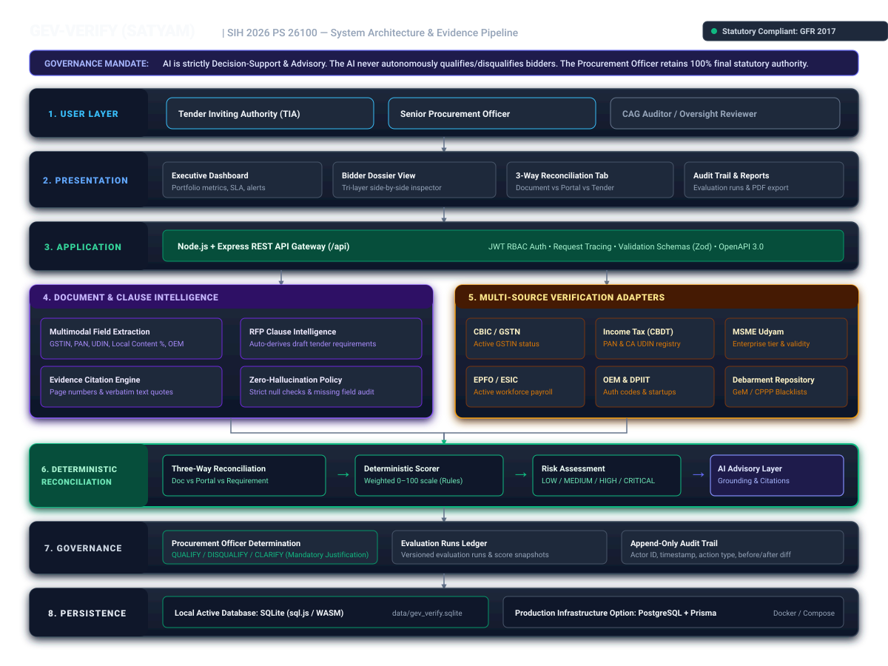
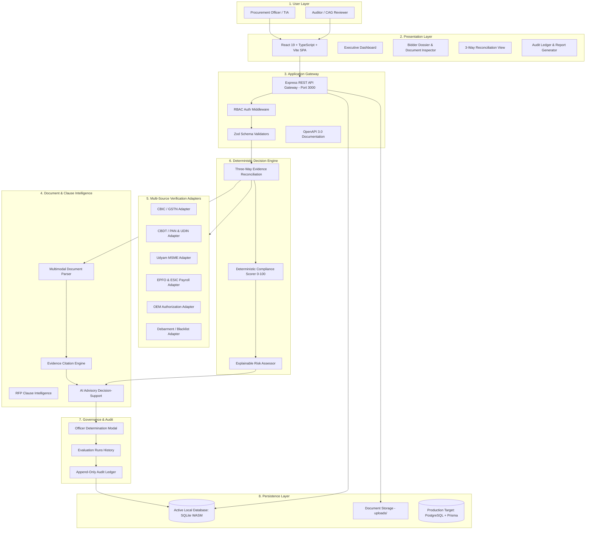

# SATYAM Architecture Specification

## Overview & Design Principles

**SATYAM** is designed as a secure, audit-grade verification and decision-support system for public procurement under the **General Financial Rules (GFR 2017)** and **Government e-Marketplace (GeM) General Terms and Conditions (GTC v4.0)**.

The architecture is built upon four non-negotiable principles:

1. **AI ≠ Final Decision**: The artificial intelligence layer provides advisory decision support and citation extraction. It is strictly prohibited from autonomously qualifying or disqualifying bidders. Final authority remains exclusively with the authorized Procurement Officer.
2. **Separation of Deterministic Rules and AI Advisory**: Mathematical compliance scores (0–100) are computed purely through deterministic rule evaluation based on verified evidence. AI models cannot alter or inflate scores.
3. **Three-Way Evidence Reconciliation**: Discrepancies are identified by cross-matching bidder-submitted documents against simulated government registries and published tender requirements.
4. **Complete Audit Provenance**: Every evaluation run, officer override, and document inspection produces an immutable audit record with actor identification and timestamps.

---

## Architectural Diagram



---

## Layered System Architecture



---

## Core Engine Details

### 1. Three-Way Evidence Reconciliation Engine
The primary innovation of GEV-VERIFY is **Three-Way Evidence Reconciliation**, comparing three independent data planes:
- **Layer 1: Bidder Document Evidence**: Raw fields extracted from uploaded PDFs and images (e.g., GSTIN, PAN, CA UDIN, declared turnover, OEM codes).
- **Layer 2: External Verification Source**: Statutory records fetched via pluggable verification adapters (simulating CBIC, CBDT, Udyam, EPFO, ESIC, DPIIT, and CPPP debarment registries).
- **Layer 3: Tender Requirement Rules**: Mandatory rulesets, threshold criteria, and financial caps configured for the tender under GFR 2017.

#### Reconciliation Status Matrix
| Condition | Reconciliation Verdict | Risk Impact | Action Trigger |
| :--- | :--- | :--- | :--- |
| Layer 1 matches Layer 2 and meets Layer 3 | **COMPLIANT** | None (Low Risk) | Full weight awarded |
| Layer 1 contradicts Layer 2 (e.g. invalid GSTIN) | **DISCREPANCY** | Elevated (High Risk) | Discrepancy logged; verification flag raised |
| Layer 1 missing mandatory document | **MISSING_EVIDENCE** | Critical | Score 0 for clause; disqualification risk |
| Layer 2 indicates active debarment/blacklist | **CRITICAL_VIOLATION** | Critical | Automatic score capping and debarment alert |
| Minor documentation shortfall | **SHORTFALL_REVIEW** | Medium | Triggers GeM 48-hour clarification window |

---

### 2. Deterministic Compliance Engine vs. AI Advisory

```
┌────────────────────────────────────────────────────────┐
│             DETERMINISTIC COMPLIANCE ENGINE            │
│  - Mathematical score calculation (0 - 100)            │
│  - Weight-based formula: (Achieved / Total) * 100      │
│  - Mandatory GFR 2017 failure = 0 for requirement      │
│  - Blacklisting violation = Critical Risk capping      │
│  - Zero hallucination, 100% reproducible               │
└───────────────────────────┬────────────────────────────┘
                            │ Feed deterministic
                            │ results into AI
                            ▼
┌────────────────────────────────────────────────────────┐
│                 AI ADVISORY LAYER                      │
│  - Strictly grounded in deterministic findings         │
│  - Explains non-compliances in procurement terminology │
│  - Recommends next steps under GeM GTC guidelines      │
│  - Displays prominent statutory legal disclaimer       │
│  - CANNOT modify or influence the compliance score     │
└───────────────────────────┬────────────────────────────┘
                            │
                            ▼
┌────────────────────────────────────────────────────────┐
│             PROCUREMENT OFFICER DECISION               │
│  - Officer reviews reconciliation matrix and advice    │
│  - Records mandatory justification for overrides       │
│  - Official determinations: QUALIFIED, DISQUALIFIED,   │
│    or CLARIFICATION_REQUESTED                          │
└────────────────────────────────────────────────────────┘
```

---

### 3. Data Persistence Architecture

- **Active Local Development Persistence**:
  - Implemented using `sql.js` (SQLite compiled to WebAssembly).
  - Automatically loads and flushes state to disk at `data/gev_verify.sqlite`.
  - Auto-seeds realistic GeM tenders, multi-tier bidders, statutory requirements, and verification data on initial startup.
  - Requires zero external database server installations for rapid prototyping and onboarding.

- **Production Infrastructure Target**:
  - A comprehensive Prisma schema (`prisma/schema.prisma`) is defined for enterprise deployments using PostgreSQL with `pgvector`.
  - Configurable via `DATABASE_URL` in `infrastructure/docker-compose.yml`.

---

### 4. Pluggable Statutory Verification Adapters

The platform architecture features 13 modular verification adapters implementing a common interface:
1. `GST`: Goods and Services Tax Network (CBIC/GSTN)
2. `PAN`: Permanent Account Number verification (CBDT)
3. `UDYAM`: Ministry of Micro, Small and Medium Enterprises (MSME)
4. `EPFO`: Employees' Provident Fund Organisation (Payroll verification)
5. `ESIC`: Employees' State Insurance Corporation
6. `INCOME_TAX`: CA UDIN and 3-year financial turnover verification
7. `STARTUP_INDIA`: DPIIT Recognized Startup validation
8. `NSIC`: National Small Industries Corporation certificate verification
9. `OEM`: Original Equipment Manufacturer authorization verification
10. `BLACKLIST`: GeM Debarment Repository and CPPP Blacklists
11. `MAKE_IN_INDIA`: Class-I/Class-II local content validation (PPP-MII Order 2017)
12. `MCA`: Ministry of Corporate Affairs (CIN & Director validation)
13. `DIGILOCKER`: Document authenticity verification

*Note: In this demonstration environment, external government APIs are simulated using controlled datasets and deterministic response adapters. In production, these adapters map to authenticated REST/SOAP endpoints.*
